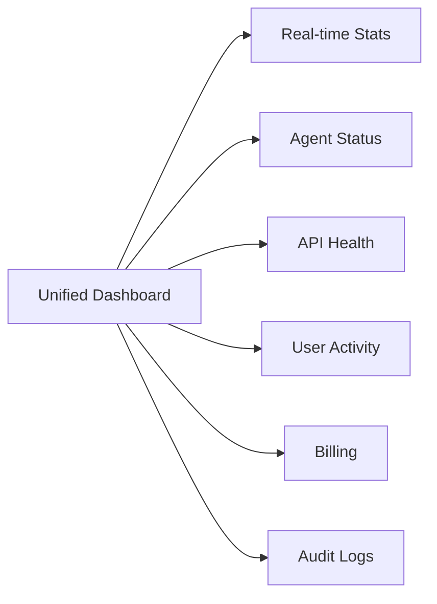

# Brainsait Unified Ecosystem - Consolidation Roadmap

*BotFather v2.1 - Professional Consolidation Plan*

---

## Executive Vision

**North Star:** "One Portal, One Gateway, Infinite Possibilities"

Transform from 130+ scattered services into a cohesive, elegantly connected ecosystem where every click leads somewhere meaningful, every API talks to each other, and users experience seamless healthcare journeys.

---

## Phase 1: Foundation (Week 1-2)

### 1.1 Unified Gateway (`api.brainsait.org`)

**Current State:** 4 separate API gateways
- `brainsait-api-gateway` 
- `basma-gateway`
- `healthbridge-api-gateway`
- Multiple sub-gateways

**Target Architecture:**
```
api.brainsait.org
├── /v1/fhir/*          → FHIR R4 endpoints
├── /v1/agents/*        → LINC Agent orchestration  
├── /v1/health/*        → Healthcare services
├── /v1/basma/*         → BASMA ERP
├── /v1/auth/*          → Unified authentication
├── /v1/realtime/*      → WebSocket hub
├── /v1/storage/*      → R2 file operations
└── /v1/analytics/*    → Telemetry
```

**Implementation:**
1. New Worker: `brainsait-unified-gateway`
2. Route patterns preserving backward compatibility
3. Central request logging to KV
4. Rate limiting per downstream service

### 1.2 Unified Sessions

**Current:** 20+ separate session stores
- `SESSIONS`, `UNIFIED_SESSIONS`
- `sudan-gov-sessions`
- `oracle-claim-scanner-SESSIONS`
- Plus cookies in browsers

**Target:** Single source of truth
1. Consolidate to `UNIFIED_SESSIONS` KV
2. JWT with refresh tokens
3. Cross-service token sharing
4. Session federation

---

## Phase 2: Agent Convergence (Week 3-4)

### 2.1 MasterLINC Unification

**Current Duplication:**
```
brainsait-masterlinc-production  ← Active
brainsait-linc-production     ← Legacy
brainsait-linc-fhir-unified    ← Experimental
givc-linc-agents              ← Claims-focused
givc-linc-agents-container   ← Container version
```

**Consolidation Strategy:**
```javascript
// Unified Agent Registry
const AGENT_REGISTRY = {
  'patient-summary': { worker: 'masterlinc', version: 'v2.1', endpoints: ['/summary'] },
  'medications': { worker: 'masterlinc', version: 'v2.1', endpoints: ['/meds'] },
  'care-plan': { worker: 'masterlinc', version: 'v2.1', endpoints: ['/careplan'] },
  'imaging': { worker: 'masterlinc', version: 'v2.1', endpoints: ['/imaging'] },
  'gaps': { worker: 'masterlinc', version: 'v2.1', endpoints: ['/gaps'] },
  'claims': { worker: 'givc-linc', version: 'v3.0', endpoints: ['/claims'] },
  'nphies': { worker: 'nphies-service', version: 'v2.5', endpoints: ['/nphies'] },
};
```

**Actions:**
1. Deprecate legacy workers (add sunset headers)
2. Redirect `/api/agents/*` → MasterLINC
3. Feature flags for gradual migration
4. Unified health endpoint

### 2.2 Durable Object Rationalization

**Current:** 20+ containers across families

**Consolidated Families:**
```javascript
// Family: FHIR Platform
'FHIRLincContainer'       // Primary FHIR operations
'HealthLincContainer'     // Health data 
'PayLincContainer'        // Payments

// Family: Communication
'ChatAgent'               // Real-time messaging
'RealtimeHub'            // WebSocket relay

// Family: Enterprise
'CodeGeneratorAgent'      // Dynamic code gen
'RateLimiterDO'           // Unified rate limiting
```

---

## Phase 3: Experience (Week 5-6)

### 3.1 Unified Dashboard (`admin.brainsait.org`)

**Current Fragmentation:**
- Separate admin panels per service
- No unified view
- Different credentials everywhere

**Target:** Single Glass Pane


**Features:**
1. **System Health** - All 130+ workers in one view
2. **Agent Leaderboard** - Performance metrics
3. **Live Logs** - Streaming from all services
4. **Quick Actions** - Restart, deploy, rollback
5. **Cost Center** - Per-service analytics

### 3.2 Navigation Mapping

**Problem:** Users get lost, links break, no clear pathways

**Solution:** Intent-Based Navigation
```typescript
interface NavigationIntent {
  // User persona
  role: 'patient' | 'provider' | 'admin' | 'developer';
  
  // Journey type
  journey: 'treatment' | 'billing' | 'enrollment' | 'compliance';
  
  // Auto-generated breadcrumbs
  breadcrumbs: [
    { label: 'Dashboard', url: '/' },
    { label: 'Patients', url: '/patients' },
    { label: 'John Doe (#12345)', url: '/patients/12345' },
    { label: 'Treatment Plan', url: '/patients/12345/care-plan' }
  ];
  
  // Smart suggestions
  suggestedNext: [
    { action: 'View Imaging', url: '/imaging?patient=12345', confidence: 0.95 },
    { action: 'Review Medications', url: '/meds?patient=12345', confidence: 0.88 }
  ];
}
```

---

## Phase 4: Integration (Week 7-8)

### 4.1 Cross-Service Communication

**Current:** Siloed, point-to-point

**Target:** Event-Driven Mesh
```javascript
// Example: New patient creates cascade
const event = {
  type: 'PATIENT_CREATED',
  payload: { patientId: '12345', name: 'Ahmed' },
  handlers: [
    'notify-registration-team',    // Email
    'create-fhir-record',           // FHIR
    'setup-billing-account',        // BASMA
    'enroll-default-pathway',       // LINC agents
    'alert-provider-matching',       // NPHIES
  ]
};

// Workers subscribe to events
export default {
  async queue(batch, env) {
    for (const event of batch.messages) {
      if (event.type === 'PATIENT_CREATED') {
        await Promise.all(event.handlers.map(h => 
          fetch(h, { method: 'POST', body: JSON.stringify(event.payload) })
        ));
      }
    }
  }
};
```

### 4.2 Shared Utilities

**Package:** `@brainsait/shared`

```typescript
// /packages/shared/index.ts
export { createAgent } from './agents';
export { authenticate } from './auth';
export { emitEvent } from './events';
export { getPatientContext } from './fhir';
export { logAudit } from './audit';
export { handleError } from './errors';

// Centralized for all workers to import
import { createAgent, authenticate, emitEvent } from '@brainsait/shared';
```

---

## Implementation Timeline

```
Week 1:   Gateway Design + Registry Setup
Week 2:   Deploy unified-gateway + backward compat
Week 3:   Agent consolidation plan
Week 4:   MasterLINC v2.1 + DO merge
Week 5:   Dashboard wireframes + shadcn setup
Week 6:   Admin portal implementation
Week 7:   Event mesh architecture
Week 8:   Shared package + documentation
```

---

## Success Metrics

| Metric | Baseline | Target |
|--------|----------|--------|
| API Gateways | 4 | 1 |
| Session Stores | 20+ | 1 |
| Agent Variations | 6 | 1 |
| Admin Portals | 10+ | 1 |
| Time to Deploy | 30min | 5min |
| Cross-Link Success | 60% | 98% |

---

## Risk Mitigation

1. **Backward Compatibility**
   - Feature flags for all redirects
   - 30-day dual running period
   - Rollback scripts ready

2. **Downtime Prevention**
   - Blue-green deployments
   - Incremental routing (1% → 10% → 100%)
   - Health check gates

3. **Data Migration**
   - Read-through caching during transition
   - Dual-write to old + new
   - 7-day reconciliation window

---

*BotFather v2.1 - Consolidated & Ready*